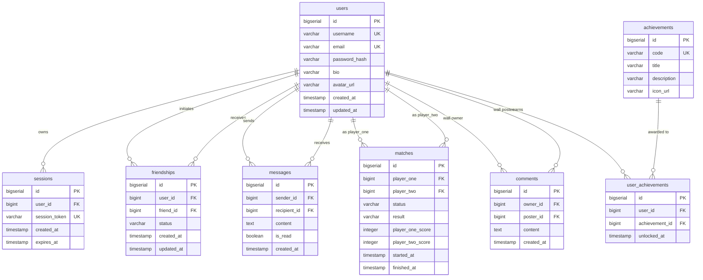

_This project has been created as part of the 42 curriculum by anpollan, jpelline, mhirvasm, nraatika, and zfarah._

# Memoir 3167 — ft_transcendence

## 1. Project Description

**Memoir 3167** is a full-stack, web-based tactical strategy game built for the **42 network ft_transcendence** project. Inspired by the tabletop boardgame Memoir '44, players draft command cards, maneuver armor, infantry and artillery units across a hexagonal grid, and resolve real-time tactical combat with dice rolls.

\
Beyond the game itself, the platform provides a complete social and competitive ecosystem:

- **User authentication**: username/password sign-in, JWT and session cookie authentication.
- **A friends system**: allowing real-time messages and match challenges to be sent.
- **Player profiles**: customizable profiles, avatar uploads, service badges/achievements, and match history.
- **Global leaderboards** tracking win rates, and player experience points.

\
**Stack at a Glance**: React 19 (TypeScript) frontend • Go 1.24 (Bun ORM) backend • Godot 4.7.1 (WASM & Headless) game client & server • PostgreSQL 16 database • Caddy 2 reverse proxy • Docker Compose

---

## 2. Instructions & Getting Started

### Prerequisites

- **Docker** (version 24.0 or newer)
- **Docker Compose** (Compose V2)
- **Make**

### Quick Start (Single Command)

The entire multi-container stack can be launched with a single command from the project root:

```bash
make
```

The `Makefile` will automatically:

1. Initialize the `./secrets/` directory if missing.
2. Generate cryptographically secure credentials (`postgres_user_pw.txt`, RSA-2048 private/public keypair `jwt_private.pem` & `jwt_public.pem`, and `gameserver_api_key.txt`).
3. Copy `.env.example` to `.env` if not already present.
4. Build all service containers and launch them in detached mode.

### Accessing the Platform

| Service                         | Address                          | Description                                        |
| :------------------------------ | :------------------------------- | :------------------------------------------------- |
| **Web Application (HTTPS)**     | `https://localhost:8443`         | Main frontend portal & Godot WASM client           |

---

## 3. Team Information & Project Management

### The Team

| Name       | 42 Intra   | Project Role                    | Core Responsibilities                                          |
| :--------- | :--------- | :------------------------------ | :------------------------------------------------------------- |
| **Antti**  | `anpollan` | Product Owner / Game Developer  | Game client                                                    |
| **Usva**   | `jpelline` | DevOps Lead / Game Developer    | Game client                                                    |
| **Niklas** | `nraatika` | Backend & Database Lead         | Go REST API, WebSocket hub, Bun ORM, schema, JWT auth, testing |
| **Miika**  | `mhirvasm` | Project Manager / Frontend Lead | React frontend, UI/UX, chat/friends UI, state management       |
| **Zak**    | `zfarah`   | Technical Lead / Game Developer | Godot headless game server                                     |

### Project Management Methodology

- **Workflow:** Agile framework with 2-week development sprints and defined milestone checkpoints.
- **Sprint Syncs:** Weekly standup meetings held in person and/or on Discord to coordinate cross-container integration. The meeting spokesperson and secretary roles were rotated on a weekly basis.
- **Git submodules**: Three separate repos to work on frontend, backend, and game without conflicts, and a Master repo for interaction
- **Version Control & Quality:** Team members followed a strict Git policy to ensure consistent format and quality. Git feature-branch workflow. All features developed on dedicated branches and merged to `main` strictly via GitHub Pull Requests after team code review and passing test suites.
- **Task Tracking:** GitHub Projects board tracking backlog issues, active work in progress.

---

## 4. Technical Stack & Architecture Justifications

### Architecture Diagram

```mermaid
flowchart TD
    Client["Web Browser (Chrome / Firefox)"]
    Caddy["Caddy Reverse Proxy & TLS (Port 8443 / 8080)"]

    subgraph Docker_Network["Docker Container Network"]
        Frontend["Frontend SPA (React 19 + TypeScript + Vite)"]
        WASM["Godot 4.7.1 WebAssembly Client (Embedded iframe)"]
        AuthAPI["Go REST API & Auth Service (:8080)"]
        WSHub["Go WebSocket Hub Microservice (:8081)"]
        GodotServer["Headless Godot Game Server (:6669)"]
        DB[("PostgreSQL 16 Database")]
    end

    Client -->|HTTPS :8443 / WSS| Caddy
    Caddy -->|/* (Static / SPA)| Frontend
    Caddy -->|/api/* (JWT)| AuthAPI
    Caddy -->|/api/ws (WSS)| WSHub
    Caddy -->|/ws* (WSS)| GodotServer

    Frontend -.->|postMessage JWT / MatchID| WASM
    WASM -->|WebSocket rpc| GodotServer

    WSHub -->|Internal REST API :8080 (X-API-Key)| AuthAPI
    AuthAPI -->|SQL Queries (Bun ORM)| DB
    GodotServer -->|Report Match Results, Match heartbeat :8080 (X-API-Key) | AuthAPI
```

### Technology Breakdown & Justifications

- **Frontend (React 19, TypeScript, Vite, Tailwind CSS, Bun):**
  - _Why:_ Single-Page Application (SPA) architecture ensures persistent WebSocket connections during route navigation. TypeScript enforces strict type safety, Vite and Bun deliver ultra-fast builds and Hot Module Replacement (HMR), and Tailwind CSS prevents CSS specificity conflicts with utility-first styling.
- **Backend (Go 1.24, `net/http`, Bun ORM, Gorilla WebSocket):**
  - _Why:_ Easy concurrency model via Goroutines, strict memory safety, and high-throughput network handling. Go's standard library provides robust HTTP multiplexing without heavy framework bloat.
- **Database & ORM (PostgreSQL 16 + Bun ORM):**
  - _Why:_ Relational data integrity for user profiles, friendship relations, message logs, and match outcomes. Bun ORM provides type-safe query generation, migrations, and automated parameterization to prevent SQL injection.
- **Game Engine (Godot 4.7.1 — Web Export & Headless Server):**
  - _Why:_ We chose to develop our game in a game engine so that we can focus on game features rather than building the whole architecture ourselves. Godot was chosen as game engine because of it's light weight and networking features. Godot web builds are significantly smaller than e.g. Unity's web builds. Both the headless server and the client were developed in Godot to make client and server communication as seamless as possible and make local testing easier.
- **Edge & Ingress (Caddy 2):**
  - _Why:_ Automatic TLS certificate management, built-in rate-limiting plugin (`caddy-ratelimit`), transparent WebSocket upgrades, and single-port ingress isolating upstream services.

---

## 5. Database Schema

All database migrations are version-controlled and applied automatically on startup via Bun ORM.



---

## 6. Selected Modules & Point Calculation

Total Points Claimed: **19 Points** (7 Major @ 2 pts + 5 Minor @ 1 pt) _(Subject minimum: 14 points)_

|   #    | Module Name                                                                    | Category          | Type  |   Points   |
| :----: | :----------------------------------------------------------------------------- | :---------------- | :---: | :--------: |
| **1**  | Implement real-time features using WebSockets                                  | Web               | Major |   2 pts    |
| **2**  | Allow users to interact with other users                                       | Web               | Major |   2 pts    |
| **3**  | Standard user management and authentication                                    | User Management   | Major |   2 pts    |
| **4**  | Implement a complete web-based game where users can play against each other    | Gaming            | Major |   2 pts    |
| **5**  | Remote players — Enable two players on separate computers to play in real-time | Gaming            | Major |   2 pts    |
| **6**  | Backend as microservices                                                       | DevOps            | Major |   2 pts    |
| **7**  | Custom module: GODOT Web & Headless Engine                                     | Modules of Choice | Major |   2 pts    |
| **8**  | Use a frontend framework (React)                                               | Web               | Minor |    1 pt    |
| **9**  | Use an ORM for the database (Bun ORM)                                          | Web               | Minor |    1 pt    |
| **10** | Game statistics and match history                                              | User Management   | Minor |    1 pt    |
| **11** | A gamification system to reward users for their actions                        | Gaming / UX       | Minor |    1 pt    |
| **12** | Custom module: Server-authoritative model for multiplayer game                 | Modules of Choice | Minor |    1 pt    |
|        | **TOTAL**                                                                      |                   |       | **19 pts** |

---

### Module Details

#### 1. Implement real-time features using WebSockets (Major — 2 pts)

- **Category:** Web
- **Description:** Low-latency communication channels for platform-wide live interactions.
- **Implementation:** Dedicated Go WebSocket hub (`/api/ws` routed through Caddy) managing persistent client connections, real-time presence indicators, instant direct message dispatch, and interactive match invitations without HTTP polling. **<TODO>Mention in-game use or no? there's a game-specific websocket claim in #5</TODO>**

#### 2. Allow users to interact with other users (Major — 2 pts)

- **Category:** Web
- **Description:** A social layer connecting players across the platform.
- **Implementation:** 1-on-1 direct messaging with unread message badges, bidirectional friendship management (send, accept, decline, delete), public profile dossiers, and interactive profile wall comments with pagination.

#### 3. Standard user management and authentication (Major — 2 pts)

- **Category:** User Management
- **Description:** Secure end-to-end identity and account lifecycle governance.
- **Implementation:** Secure registration and login with bcrypt password hashing, dual-token architecture (HTTP-only session cookies + short-lived RS256 JWTs), single active session enforcement, customizable avatars, and GDPR-compliant account deletion/anonymization.

#### 4. Implement a complete web-based game where users can play against each other (Major — 2 pts)

- **Category:** Gaming and user experience
- **Description:** A full-featured tactical hex-grid wargame (**Memoir 3167**) where two players compete head-to-head.
- **Implementation:** A multiplayer game with separate clients and a dedicated server-authoritative server that can run multiple concurrent matches. Clients connect to the server over web sockets and the syncing is handled by RPC calls through which the server is sending the current state of the game to clients. All of the critical gameplay logic is handled by the server to restrict the players from cheating.

#### 5. Remote players — Enable two players on separate computers to play in real-time (Major — 2 pts)

- **Category:** Gaming and user experience
- **Description:** Synchronized online multiplayer across separate devices over the network.
- **Implementation:** The game server Players challenge friends via the frontend interface. The players are connected to the server over web sockects. The server incorporates a 30-second disconnection grace period, mid-match reconnection state recovery, and automated sweep of abandoned matches.

#### 6. Backend as microservices (Major — 2 pts)

- **Category:** DevOps
- **Description:** Decoupled, specialized service architecture with single-responsibility boundaries.
- **Implementation:** Isolated Docker services partitioned across dedicated bridge networks (`frontend_network`, `backend_network`, `database_network`):
  1. _Caddy Gateway:_ Edge ingress, automated TLS, and rate limiting.
  2. _Go Server:_
  - REST API & authentication.
  - WebSocket realtime messaging hub.
  3. _Godot Server:_ Headless match management and combat engine.
  4. _PostgreSQL:_ Persistent database.

#### 7. Custom Module: GODOT Web & Headless Engine (Major — 2 pts)

- **Category:** Modules of Choice
- **Description:** Integration of the Godot game engine into a modern containerized web stack.
- **Implementation:** Godot game clients are exported into WebAssembly/HTML5, bridging JWT authentication and match IDs via secure `postMessage` handlers, and containerizing a headless Linux Godot binary running natively on the server.
- **Justification:** Building our game in Godot allowed us to take the game development and features a lot further than building the game from scratch in pure code. In games industry it's a standard to use either publicly accessible game engines(e.g. Godot, Unity or Unreal Engine) or proprietary game engines when developing games and we wanted to get experience in working with such engines.

#### 8. Use a frontend framework — React (Minor — 1 pt)

- **Category:** Web
- **Description:** Modern, component-driven Single Page Application (SPA).
- **Implementation:** Built with React 19, TypeScript, and Vite.

#### 9. Use an ORM for the database — Bun ORM (Minor — 1 pt)

- **Category:** Web
- **Description:** Structured object-relational mapping ensuring type safety and schema consistency.
- **Implementation:** Powered by Bun ORM in Go. Manages relational mapping (`users`, `sessions`, `matches`, `friendships`, `messages`, `achievements`), automated schema migrations, and parameterized queries that eliminate SQL injection risks.

#### 10. Game statistics and match history (Minor — 1 pt)

- **Category:** User Management
- **Description:** Performance tracking, historical match reviews, and competitive rankings.
- **Implementation:** Detailed post-match recording (scores, participants, outcomes, timestamps), user profile statistics (wins, losses, win rates), paginated match history drawers, and an in-memory cached global leaderboard.

#### 11. A gamification system to reward users for their actions (Minor — 1 pt)

- **Category:** Gaming and user experience
- **Description:** Dynamic reward engine incentivizing engagement and competitive mastery.
- **Implementation:** System-awarded achievements and service badges. Badges are evaluated asynchronously upon qualifying triggers (match victories, social interactions) and showcased on player profiles.

#### 12. Custom Module: Server-authoritative model for multiplayer game (Minor — 1 pt)

- **Category:** Modules of Choice
- **Description:** Strict server-authoritative netcode eliminating client-side tampering and desyncs.
- **Implementation:** All game rules, card validations, legal unit movements, and dice rolls are executed exclusively on the headless Godot server. Web clients act strictly as interfaces for sending player intents and receiving authoritative game state diffs over binary WebSocket frames.
- **Justification:** 

---

## 7. Features & Team Attribution

| Feature Category              | Description                                                                                                 | Primary Authors        |
| :---------------------------- | :---------------------------------------------------------------------------------------------------------- | :--------------------- |
| **Authentication & Sessions** | Register, Login, bcrypt hashing, dual-token auth (JWT + Session cookies), single active session enforcement | `nraatika`             |
| **User Profiles & Avatars**   | Profile management, secure avatar upload (PNG re-encoding), bio updates, wall comments                      | `nraatika`, `mhirvasm` |
| **Friends & Social Hub**      | Friend requests, real-time presence indicators, unread indicators, friend deletion dispatch                 | `nraatika`, `mhirvasm` |
| **Direct Messaging**          | Low-latency 1-on-1 WebSocket chat, DB message persistence, unread counters                                  | `nraatika`, `mhirvasm` |
| **Matchmaking & Invites**     | Challenge invitations via WebSocket, dynamic room provisioning, game server handoff                         | `nraatika`, `zfarah`   |
| **Leaderboard & Badges**      | Global ranking system, cached stats, service achievements / badges                                          | `nraatika`, `mhirvasm` |
| **Docker & Infrastructure**   | Multi-service Compose architecture, Caddy TLS/reverse proxy, automated secrets Makefile                     | `jpelline`, `nraatika` |
| **Legal Pages & Compliance**  | Dedicated Privacy Policy, Terms of Service, account anonymization, cookie disclosures                       | `mhirvasm`             |

---

## 8. Resources & AI Usage

### References & Documentation

- [Go Documentation & Standard Library](https://golang.org/doc/)
- [Bun ORM Documentation](https://bun.uptrace.dev/)
- [Caddy Server Documentation](https://caddyserver.com/docs/)
- [Godot Documentation](https://docs.godotengine.org/en/stable/index.html)

### Explicit Disclosure of AI Usage (42 Requirement)

In accordance with 42 School guidelines, AI tools were utilized during development under strict human direction:

- **Tasks Delegated to AI:**
  - Drafting initial boilerplate structures (Go struct model tags, table-driven test templates, Tailwind class scaffolding).
  - Exploring potential implementations to Issues
- **Human Oversight & Verification:**
  - All architectural decisions, security boundaries, database relational design, and game mechanics were formulated and approved by the team.
  - Every line of AI-suggested code was manually reviewed, and validated in testing prior to committing.

---

## 9. Individual Contributions

### Antti (`anpollan`)

- _Role:_ Product Owner / Game Developer
- _Contributions:_ Architected the client-side gameplay systems, phase-driven state machine, and hex-grid tactical mechanics in Godot. Implemented client-side pathfinding, Line of Sight and range highlighting, combat resolution sequences and interactive camera controls. Defined core game rules, unit statistics, and milestone priorities to align implementation with Memoir '44 mechanics.

### Usva (`jpelline`)

- _Role:_ DevOps Lead / Game Developer
- _Contributions:_

### Niklas (`nraatika`)

- _Role:_ Backend & Database Lead
- _Contributions:_ Architected the Go REST API and WebSocket microservices, Bun ORM relational models and schema migrations, RS256 JWT auth rotation and session management, and comprehensive table-driven automated test suites.

### Miika (`mhirvasm`)

- _Role:_ Project Manager / Frontend Lead
- _Contributions:_ Designed the SPA frontend and its global state architecture to guarantee persistent, application-wide WebSocket connectivity without redundant renders. Implemented the dual-token JWT authentication flow, resilient WebSocket reconnection logic, and managed the secure Godot WebAssembly iframe integration for memory isolation. Drove project management by establishing GitHub Project boards, repository policies, and milestone tracking systems to monitor and organize development progress.

### Zak (`zfarah`)

- _Role:_ Technical Lead / Netcode Lead
- _Contributions:_ Architected and implemented a **server-authoritative multiplayer architecture**, with the server running core game logic, acting as the single source of truth, and managing multiple concurrent matches. Implemented client-server communication and real-time state synchronization, including robust handling of latency, disconnections, and reconnections.
